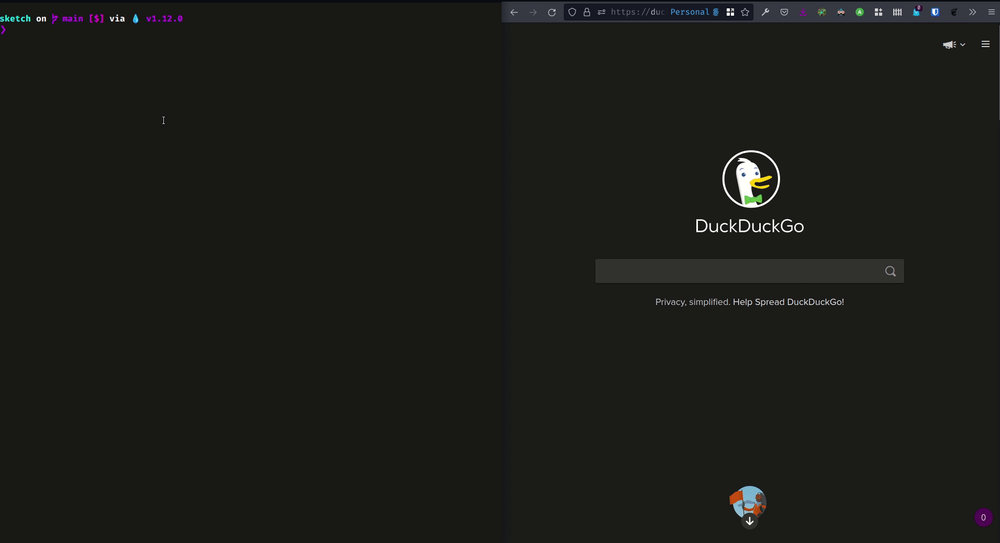

# Sketch

## Demo:



## Instructions:

Sketch is a GraphQL API to draw on a canva. 

The core functionalities of drawing on a canvas are implemented in [`canvas.ex`](lib/sketch/domain_models/canvas/canvas.ex).
The GraphQL schema, with its queries, mutations and subscriptions is to be found in [`schema.ex`](lib/sketch_web/graphql/schema/schema.ex).
You can talk to the server either with the GraphiQL client (for reads and writes) or the browser (read-only client). LiveView is used to avoid browser refreshes and update the web page with the new canvas/drawing in real-time.

To play around, follow those instructions:

  * Install dependencies with `mix deps.get`
  * Create and migrate your database with `mix ecto.setup`
  * Start Phoenix endpoint with `mix phx.server` or inside IEx with `iex -S mix phx.server`
  * Now you can visit [localhost:4000/canvas](http://localhost:4000/canvas) from your browser.
  * In a new window, visit the [GraphiQL endpoint](http://localhost:4000/api/raphiql).
  * Upload the [GraphiQL workspace](graphiql-workspace-2021-11-15-19-02-33.json) (_note: you might need to refresh GraphiQL or select a query from the workspace history_).
  * You'll find three tabs with pre-made queries in each. Each sequence of queries in a tab corresponds to a test fixture. Give it a try!
  * On [localhost:4000/canvas](http://localhost:4000/canvas), you'll find the web page that displays all the canvas unique global identifiers. If a new canvas is added, its id will appear here automatically, without you having to refresh the web page.
  * If you want to see a specific canvas and how it changes as it is updated, simply click on its id. 


## Running the tests:
```elixir
mix test --trace
```
